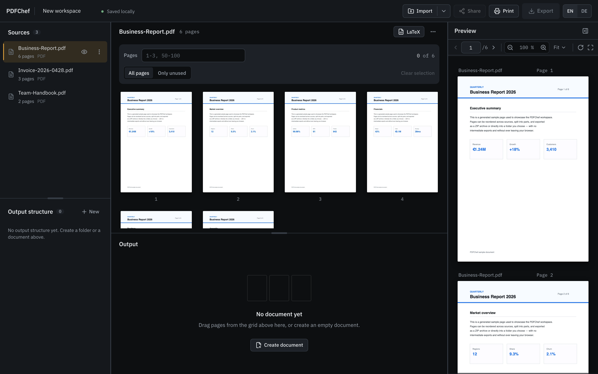
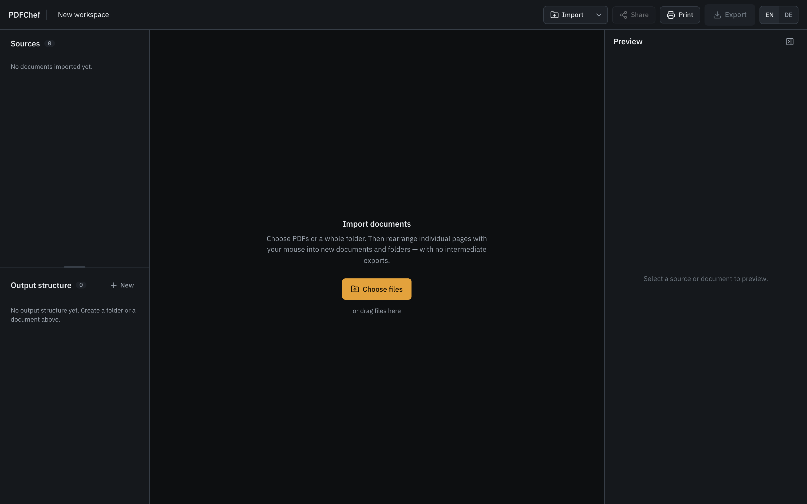
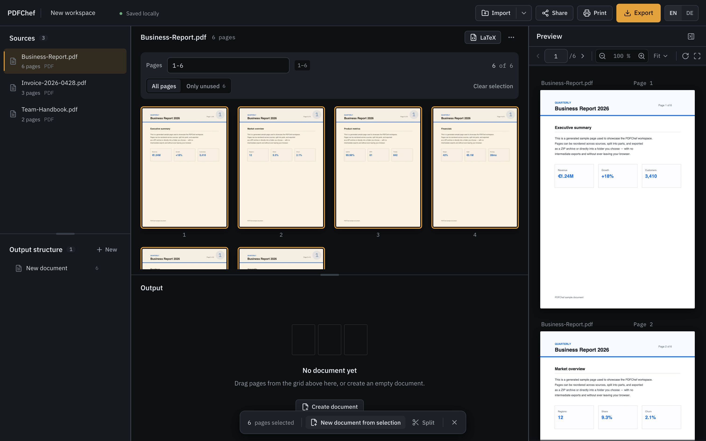

# PDFChef

**The document Swiss Army knife — in your browser.** PDFChef is a local-first document
workspace: import several documents, drag individual **pages** into entirely new documents and
folder structures, and export the result — **with no intermediate exports**.

It is deliberately more than a PDF merger/splitter: it is a **file manager for document pages**.

<p align="center">
  
</p>

<p align="center">
  
  
  
  
  
  
  
</p>

---

## Idea

- **Sources are immutable.** Your work is a composition layer of references to source pages —
  the original is never modified.
- **Direct manipulation:** Select → drag → drop → preview → export.
- **Local-first & private:** No account, no server, no cloud database. All documents stay in
  your browser (IndexedDB) and never leave your device.

## Features

- **Import** one or many files, whole **folders**, and via **drag-and-drop**; **ZIP archives**
  are unpacked automatically. Formats: PDF, images (PNG/JPG/WebP/GIF), TXT, Markdown, DOCX, PPTX, XLSX.
- **Reorder pages** with the mouse — within a document and **across sources** (e.g. a page from
  PDF A into a document with pages from PDF B).
- **Select** via a range field (`4-49`, `1-3,50-100`), click/Shift/Ctrl, and **marquee**
  (drag a rectangle with the mouse).
- **Folders & output documents** created and nested freely; this is how you build your export structure.
- **Split** a document into several parts — equal halves/thirds, every N pages, custom ranges,
  the current selection, or at blank separator pages. **Every part gets its own name.**
- **Annotate & fill:** add text, shapes, highlights, checkmarks and signatures on top of pages —
  preview matches export exactly. Reusable building blocks live in a **library**.
- **Preview** source and result pages with zoom, page navigation and **search** (including OCR
  for scanned PDFs).
- **Export** as a **ZIP** or — where supported — directly **into a folder you choose** (the whole
  structure in one step). Names are editable before export; individual folders/documents can be
  exported separately.
- **LaTeX** generated from a document (text extraction → `.tex`).
- **Bilingual UI:** English and German, switchable in the header (English by default).
- **PWA:** installable and usable offline.
- **Undo/Redo** across the whole session; **trash** for deleted items; **autosave**.

## Screenshots

<table>
  <tr>
    <td width="50%" valign="top">
      <br/>
      <sub><b>Import</b> — drop in files, whole folders or ZIP archives.</sub>
    </td>
    <td width="50%" valign="top">
      <br/>
      <sub><b>Compose</b> — select pages by range or marquee and build new documents.</sub>
    </td>
  </tr>
</table>

## Quick start

Requirements: **Node ≥ 20** and **npm**.

```bash
npm install
npm run dev        # dev server (http://localhost:5173, or the next free port)
```

More scripts:

```bash
npm run build      # typecheck + production build (dist/)
npm run preview    # serve the production build locally
npm test           # unit tests (Vitest)
npm run typecheck  # TypeScript, no emit
npm run lint       # ESLint
npm run format     # Prettier
```

> Before `dev`/`build`/`test`, pdf.js and tesseract.js assets are synced into `public/`
> automatically (`predev`/`prebuild`/`pretest`) so the app runs fully offline.

## Browser support

- Runs in current Chromium, Firefox and Safari browsers.
- **Direct folder export** (File System Access API) is Chromium-only; everywhere else the
  **ZIP export** is a full-featured alternative — no feature silently disappears.

## Architecture

Strict layering, enforced by ESLint — dependencies point downward only:

```
domain    pure, framework-free logic (ranges, split, composition, commands/undo, export plan) — unit-tested
adapters  formats: PDF (pdf.js/pdf-lib), images, text/OOXML; rendering & text extraction
services  store (Zustand), persistence (IndexedDB), thumbnails, import/export, search/OCR
ui        React interface (shell, sources, workspace, preview, export), i18n
workers   text extraction off the main thread
```

Guiding rules: source documents are immutable; every user action is a **named command** with a
derived undo inverse; pure logic is built with **TDD**, UI/flows verified with Playwright.

## Tech stack

React 19 · TypeScript (strict) · Vite · Tailwind CSS v4 · Zustand + Immer ·
pdf.js (`pdfjs-dist`) & pdf-lib · tesseract.js (OCR) · mammoth/xlsx (OOXML) · fflate (ZIP) ·
idb (IndexedDB) · Vitest & Playwright.

## Privacy

There is **no** network traffic with document contents, no tracking, and no external runtime
requests. pdf.js workers, fonts and OCR data ship with the app.
